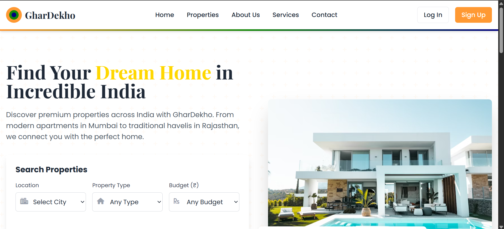
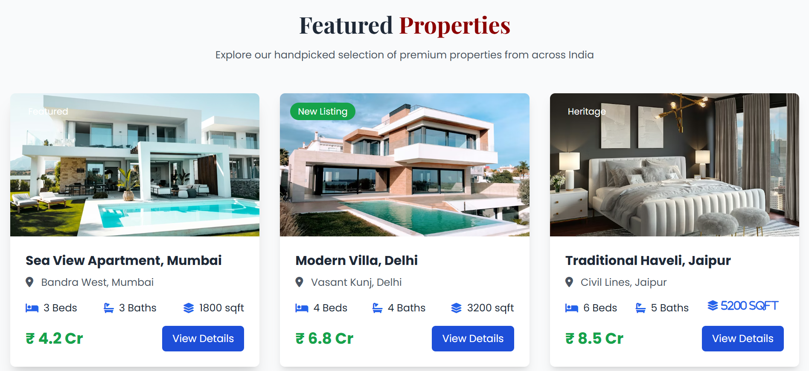
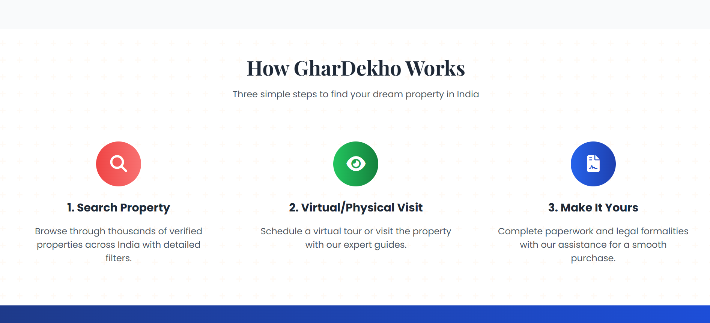
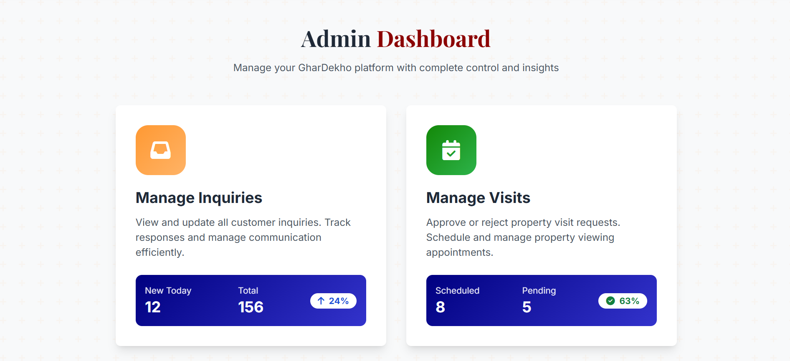
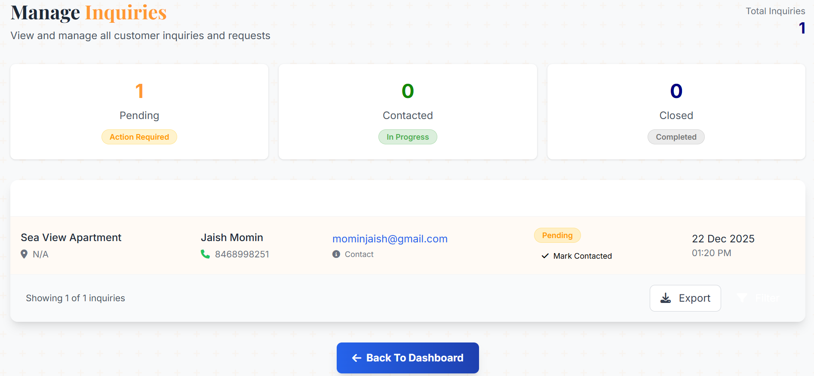
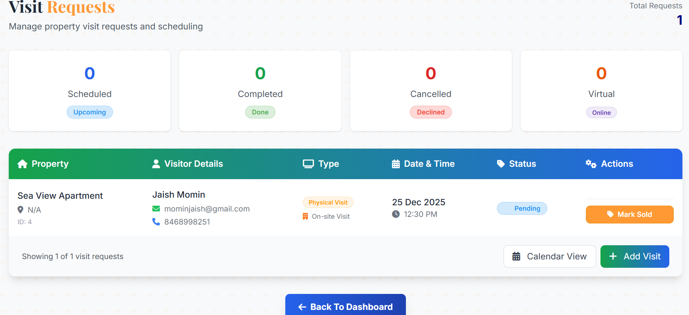

# 🏠 GharDekho

> **Real Estate Property Management Platform** — A full-stack PHP and MySQL web application for discovering, listing, and managing residential and commercial properties.

GharDekho is a real-estate web application designed to simplify property discovery and management. Users can explore properties for rent and sale, while property information is organized through a structured backend connected to MySQL.

---

## ✨ Features

### 🏘️ Property Listings
- Browse properties available for **Rent** and **Sale**
- Support for multiple property types:
  - Flats
  - Offices
  - Shops
  - Bungalows
  - Plots
  - Godowns
- View detailed property information
- Property-specific forms for collecting listing details

### 🔍 Property Management
- Structured property data management
- MySQL database integration
- Separate rental and sales workflows
- Property details stored and retrieved dynamically

### 📧 Email Integration
- SMTP-based email communication
- Configurable email credentials through environment variables

### 🎨 Responsive Frontend
- Clean real-estate focused interface
- Property search and browsing experience
- Responsive layouts for different screen sizes

---

## 🛠 Tech Stack

| Layer | Technology |
|---|---|
| **Frontend** | HTML, CSS, JavaScript |
| **Backend** | PHP |
| **Database** | MySQL |
| **Email** | SMTP |
| **Dependency Management** | Composer |
| **Development Environment** | XAMPP / Apache |

---

## 📸 Screenshots

### 🏠 Homepage


### 🏘️ Featured Properties


### ⚙️ How It Works


### 👨‍💼 Admin Dashboard


### 📩 Manage Inquiries


### 📅 Visit Requests


---

## 📁 Project Structure

```text
ghardekho/
├── db/                    # Database files / SQL
├── public/                # Public assets and web-accessible files
├── src/                   # PHP application source code
├── .env.example           # Environment variable template
├── .gitignore
├── composer.json          # PHP dependencies
├── composer.lock
└── README.md

